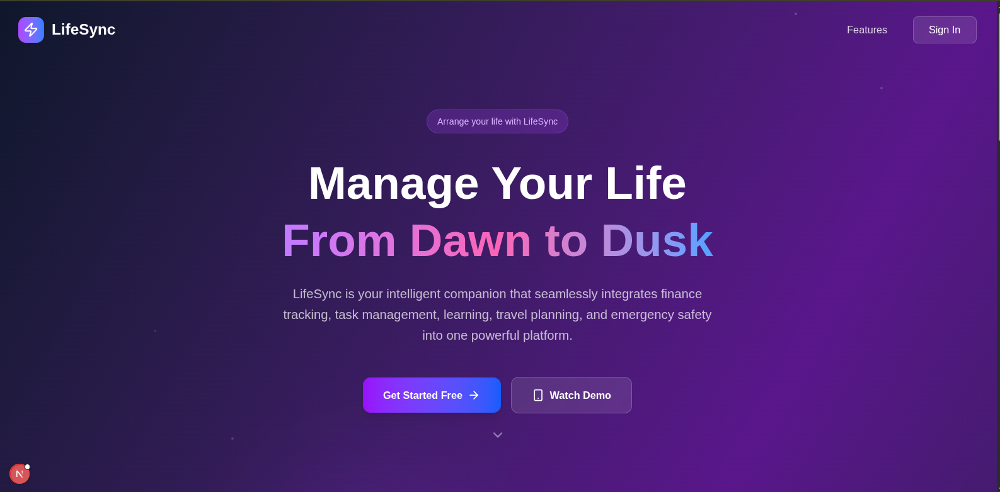
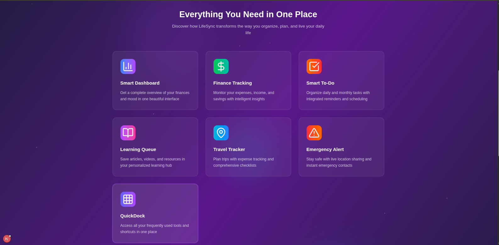
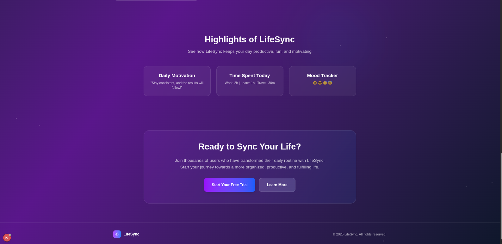
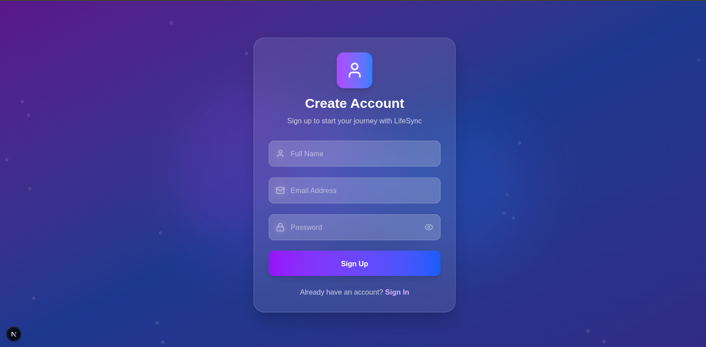
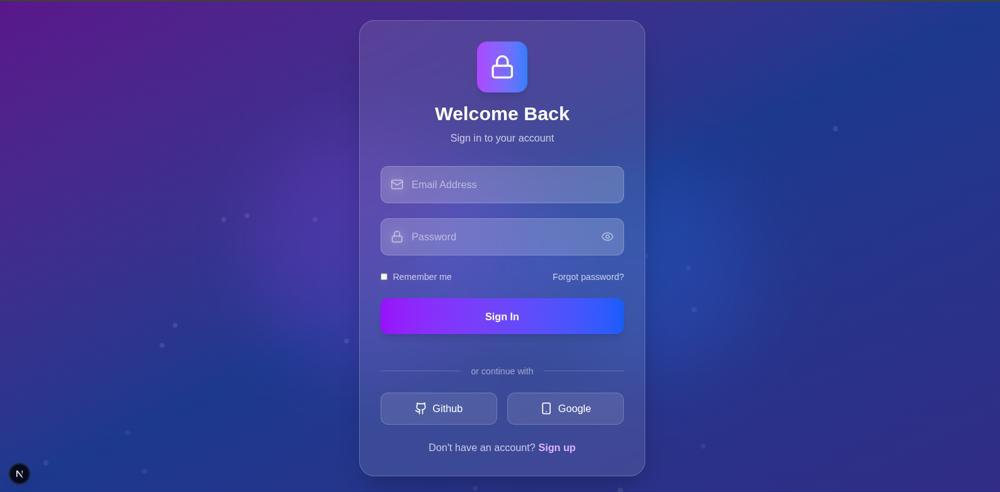
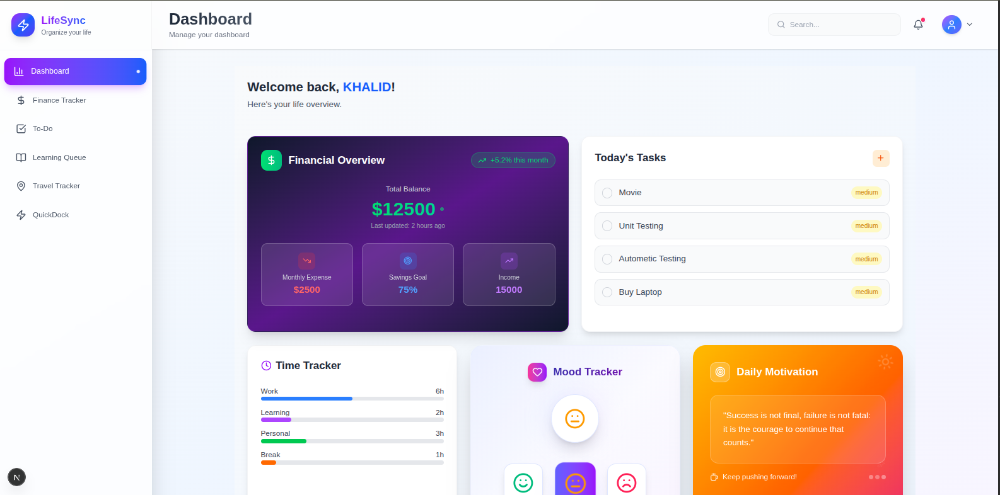
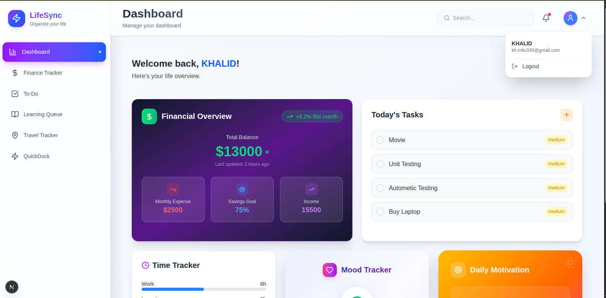

# LifeSync

LifeSync is a personal dashboard designed to help you organize your daily life, including tasks, finances, and travel plans. It provides a central hub to manage various aspects of your life, enhancing productivity and organization.

## Features

-   **Dashboard:** A central hub for all your activities.
-   **To-Do List:** Manage your daily tasks and stay productive.
-   **Finance Tracker:** Keep track of your income and expenses.
-   **Emergency Contacts:** A place to store important contacts for emergencies.
-   **Travel Planner:** Plan your trips and adventures.
-   **Learning Hub:** Organize your learning resources and track your progress.

## Screenshots

**Homepage**





**Authentication**




**Dashboard**



**To-Do**


**Finance Tracker**


**Travel Tracker**


**Learning Hub**


**Quick Dock**


**Logout**




## Technologies Used

### Frontend

-   [Next.js](https://nextjs.org/) - React framework for production.
-   [React](https://reactjs.org/) - A JavaScript library for building user interfaces.
-   [Tailwind CSS](https://tailwindcss.com/) - A utility-first CSS framework.
-   [Framer Motion](https://www.framer.com/motion/) - A production-ready motion library for React.

### Backend

-   [Node.js](https://nodejs.org/) - A JavaScript runtime built on Chrome's V8 JavaScript engine.
-   [Express](https://expressjs.com/) - A minimal and flexible Node.js web application framework.
-   [MySQL](https://www.mysql.com/) - An open-source relational database management system.

## Getting Started

To get a local copy up and running, follow these simple steps.

### Prerequisites

-   Node.js and npm installed
-   MySQL database

### Installation

1.  **Clone the repository:**
    ```bash
    git clone https://github.com/khaledhasanmilu/LifeSync.git
    ```
2.  **Navigate to the project directory:**
    ```bash
    cd LifeSync
    ```
3.  **Install backend dependencies:**
    ```bash
    cd backend
    npm install
    ```
4.  **Create a `.env` file in the `backend` directory** and add your MySQL database credentials:
    ```
    DB_HOST=your_host
    DB_USER=your_user
    DB_PASSWORD=your_password
    DB_NAME=your_database_name
    ```
5.  **Install frontend dependencies:**
    ```bash
    cd ../forntend
    npm install
    ```

### Running the Application

1.  **Start the backend server:**
    ```bash
    cd backend
    npm run dev
    ```
2.  **Start the frontend development server:**
    ```bash
    cd ../forntend
    npm run dev
    ```
3.  Open your browser and navigate to `http://localhost:3000`.

## Project Structure

```
/
├── backend/
│   ├── controller/
│   ├── db/
│   ├── routes/
│   └── ...
└── forntend/
    ├── app/
    │   ├── (afterAuth)/
    │   ├── login/
    │   └── signup/
    └── ...
```

## API Endpoints

The base URL for all the endpoints is `/users`.

-   `GET /`: Get all users.
-   `POST /signup`: Create a new user.
-   `POST /login`: Log in a user.

For more details on the API, please refer to the `API_DOCUMENTATION.md` file.

## Pages

-   **/login:** User authentication page.
-   **/signup:** User registration page.
-   **/dashboard:** The main dashboard with an overview of all features.
-   **/todo:** A page to manage your to-do list.
-   **/finance:** A page to track your finances.
-   **/emergency:** A page to store emergency contacts.
-   **/travel:** A page to plan your travels.
-   **/learning:** A page to organize your learning materials.
-   **/quickdock:** A page for quick access to your most used features.

## Contributors

-   [Khaled Hasan Milu](https://github.com/khaledhasanmilu)
-   [Sumiya Akter Subarna](https://github.com/Subarna-007)
-   [Minhazul Islam Sizan](https://github.com/sizan2119254)
